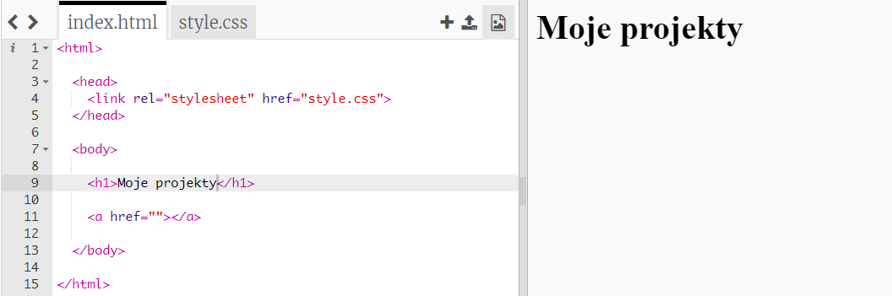

## Dodawanie linków do stron internetowych

Linki tekstowe umożliwiają ci przeniesienie się do innych stron po kliknięciu; zwykle są podkreślone.

+ Otwórz edytor: [jumpto.cc/web-showcase](http://jumpto.cc/web-showcase).
    
    Twój projekt powinien wyglądać następująco:
    
    

+ HTML wykorzystuje `<a>` tag dla linków.

+ Znajdź `<a>` tag w swoim projekcie. 

+ Dodaj adres Klubu Kodowania [`https://www.codeclub.org.uk`](https://www.codeclub.org.uk) i tekst do linku:

+ Kliknij Run, aby przetestować swój szablon.

+ Kliknij link Klubu Kodowania, aby przetestować swoją stronę internetową. Twój szablon będzie pokazywał stronę Klubu Kodowania: 

+ Aby wrócić do swojej strony, możesz albo:
    
    + Uruchomić szablon ponownie,
    
    + Wcisnąć Backspace na klawiaturze, lub
    
    + Kliknąć prawy przycisk myszki i wybrać powrót.

+ Teraz dołącz swój link do zdania w akapicie:

Przetestuj swoją stronę.