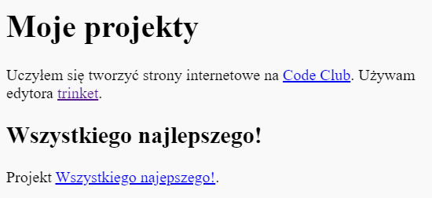

## Link do szablonu

Możesz stworzyć link do szablonu.

+ Czy nadal masz link do szablonu projektu Wszystkiego Najlepszego? Jeśli tak, otwórz szablon w nowej karcie przeglądarki. Jeśli nie, otwórz ukończony szablon przykładowy: <https://trinket.io/html/e996dc0380>

+ Wybierz zakładkę Share nad wybranym szablonem i wybierz przycisk Link:

If you opened the trinket from your account then look for the Share option above your trinket instead:

+ Wybierz 'Only show code or result (let users toggle between them)' (ang. Pokaż jedynie kod lub wynik (zezwól użytkownikom na wybór)) i skopiuj link do szablonu. 

+ Wróć do szablonu listy projektów i dodaj `<h2>` tytuł i link do projektu Wszystkiego Najlepszego.

Przetestuj swoją stronę; powinna wyglądać mniej więcej tak:

Kliknij link Wszystkiego Najlepszego, aby sprawdzić, czy zabierze cię do wybranego szablonu.