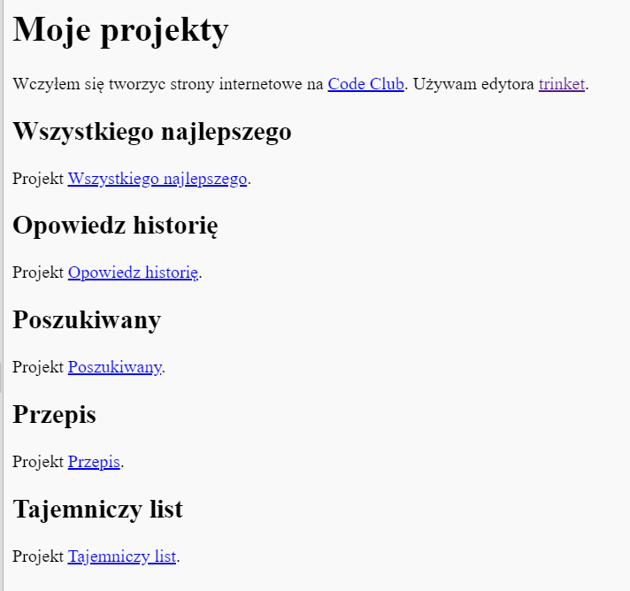

\--- challenge \---

## Wyzwanie: Stwórz listę swoich projektów

Dodaj inne projekty CSS i HTML, które stworzyłeś w Code Club. Użyj `<h2>` nagłówków, aby poukładać rzeczy na stronie.

Jeśli nie masz linków do projektów, które stworzyłeś, możesz użyć przykładów z Code Club:

+ Wszystkiego Najlepszego!: <https://trinket.io/html/e996dc0380>

+ Opowiedz historię: <https://trinket.io/html/c8afdef912>

+ Poszukiwany: <https://trinket.io/html/ebeb56398a>

+ Przepis: <https://trinket.io/html/c0fd9b40cd>

+ Tajemniczy list: <https://trinket.io/html/1d4d4c5ce1>

Twoja skończona strona powinna wyglądać mniej więcej tak:

\--- /challenge \---