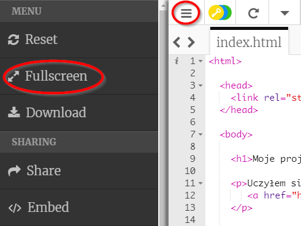
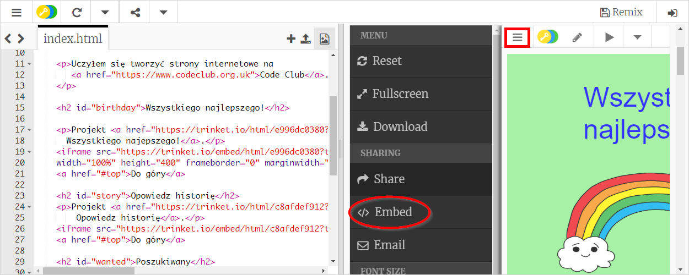
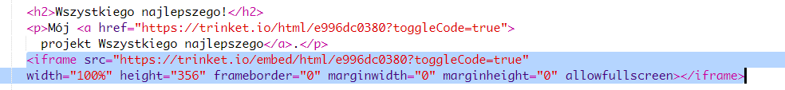
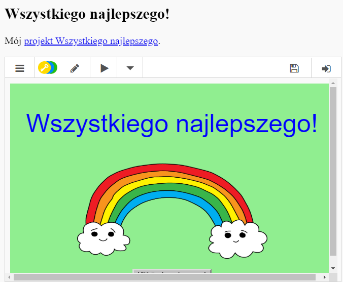
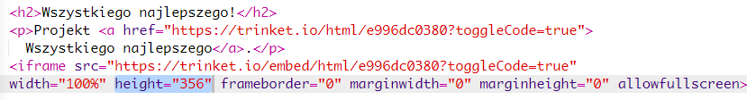
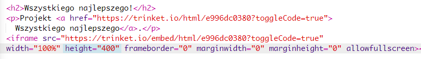

## Osadzanie projektów

Możesz nie tylko linkować szablony w formie stron internetowych, możesz je również osadzić w swojej stronie.

+ Włącz tryb pełnego ekranu, aby mieć więcej miejsca do pracy:

Naciśnij klawisz Esc, aby wyłączyć tryb pełnoekranowy.

+ Uruchom szablon i kliknij link do projektu Wszystkiego Najlepszego.

+ Kliknij menu szablonów i wybierz **embed** (ang. osadź). Jeśli nie korzystasz z trybu pełnoekranowego, zapewne będziesz musiał przewinąć stronę w dół. Użyj paska przewijania po prawej stronie lub strzałki w dół na klawiaturze.

+ Wybierz 'Only show code or result (let users toggle between them)' (ang. Pokaż jedynie kod lub wynik (zezwól użytkownikom na wybór)) i **skopiuj** kod osadzający dla wybranego szablonu. 

+ Szablon automatycznie stworzył kod HTML, który możesz dodać do swojej strony. Wykorzystuje on `<iframe>` tag, który pozwala osadzić zawartość na stronie.

+ Skopiuj kod pod linkiem do szablonu Wszystkiego Najlepszego:

+ Uruchom szablon, aby go przetestować. Powinieneś zobaczyć projekt Wszystkiego Najlepszego osadzony na stronie. 

+ W niektórych sytuacjach dolna część projektu może się nie wyświetlać. Możesz to naprawić zmieniając wartość wysokości na `<iframe>`iframe</0>. 

Ustaw wysokość na **400**. Jeśli w jakiś sposób zmieniałeś projekt Wszystkiego Najlepszego, może będziesz musiał wybrać inną wartość.

