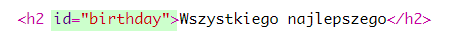
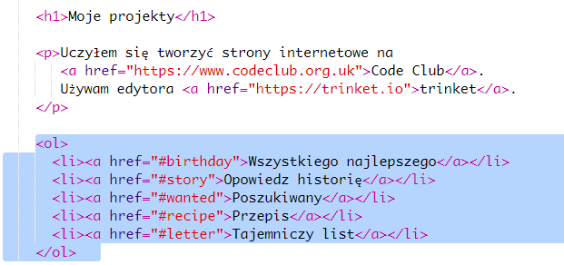
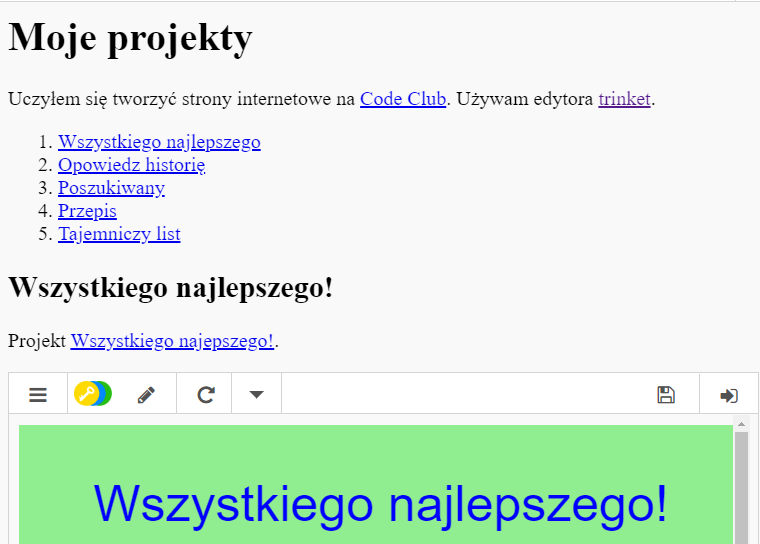

## Stwórz spis treści

Dodajmy do twojego projektu spis treści, aby prościej poruszać się między projektami.

+ Jesteśmy w stanie stworzyć linki do innych stron internetowych, ale także odnośniki do części twojej strony internetowej, jeśli przypiszemy fragmentom kod id. 

Dodaj kod id do `<h2>` tytułu projektu Wszystkiego Najlepszego:

+ Dodaj kody id do każdego ze swoich projektów i nadaj im krótkie nazwy: historia, poszukiwany, przepis i list.

+ Możesz dodać link do elementu posiadającego kod id dodając krzyżyk '#' przed jego nazwą. Na przykład, `#urodziny`.

Stwórz posegregowaną listę linków do twoich projektów. (Takie listy zostały wprowadzone w projekcie Przepis.)

+ Uruchom swój projekt i przetestuj go, klikając linki przenoszące do różnych części twojej strony. 

