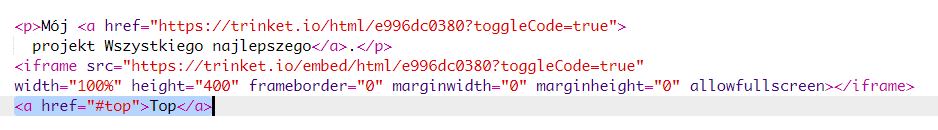
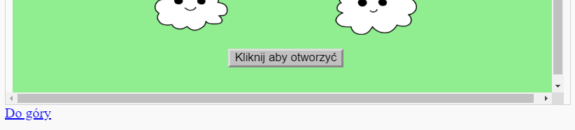

## Powrót na górę

+ Przydatna będzie możliwość powrotu na górę twojej strony. HTML posiada właściwość `#top` specjalnie na takie okazje.

+ Dodaj link `#top` po każdy projekcie, który jest osadzony na twojej stronie:

+ Przetestuj swoje linki, klikając Top, aby wrócić na górę strony.