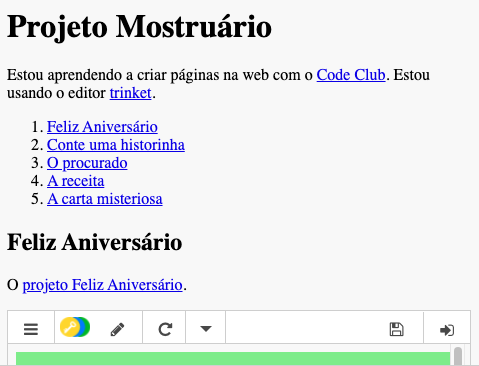

## Introdução

Neste projeto, você criará um mostruário de seus projetos HTML e aprenderá sobre links e recursos de incorporação.

### Informações adicionais para líderes de clube

Se você precisar imprimir este projeto, use a [Versão para Impressão](https://projects.raspberrypi.org/en/projects/project-showcase/print).

## \--- collapse \---

## título: Notas do líder do clube

## Introdução:

Neste projeto, as crianças são apresentadas a hiperlinks e incorporar complementos e projetos do Scratch em uma página da web.

## Recursos online

Recomendamos usar o [trinket](https://trinket.io/) para escrever HTML & CSS online. Este projeto contém o seguinte trinket:

* [Ponto de partida 'Projeto Mostruário' -- jumpto.cc/web-showcase](http://jumpto.cc/web-showcase)

As crianças também podem usar este trinket em branco [(jumpto.cc/html-blank)](http://jumpto.cc/html-blank) para escrever seu próprio HTML & CSS, ou como alternativa, elas podem usar este modelo de trinket [(jumpto.cc/html-template)](http://jumpto.cc/html-template).

Há também um trinket contendo uma solução de exemplo para os desafios:

* ['Projeto Mostruário Finalizado' -- trinket.io/html/5b815ab120](https://trinket.io/html/5b815ab120)

## Recursos locais ou offline

Este projeto pode ser [concluído offline](https://www.codeclubprojects.org/en-GB/resources/webdev-working-offline/), se você preferir. Você pode acessar os recursos disponíveis clicando no link 'Materiais do Projeto'. Este link contém uma seção "Recursos do Projeto", que inclui recursos que as crianças precisarão para concluir esse projeto no localmente ou offline. Certifique-se de que cada criança tenha acesso a uma cópia desses recursos. Esta seção inclui os seguintes arquivos:

* project-showcase/index.html
* project-showcase/style.css
* template/template.html
* template/style.css

Você também pode encontrar uma versão completa dos desafios deste projeto na seção "Recursos para Voluntários", que contém:

* project-showcse-finished/index.html
* project-showcse-finished/style.css

(Todos os recursos acima também podem ser baixados como arquivos `.zip` do projeto e voluntário.)

Observe que, se as crianças concluírem seus outros projetos offline, elas não poderão incorporá-los, mas ainda assim poderão vinculá-los a eles.

## Objetivos do Aprendizado

* Este projeto apresenta links de texto para outras páginas da Web e para códigos "Id" nomeados em uma página. Ele também introduz como incorporar trinkets e projetos Scratch em uma página da web. 

Este projeto abrange elementos das seguintes vertentes do [Currículo de Criação Digital Raspberry Pi](http://rpf.io/curriculum):

* [Design de ilustrações 2D e 3D básicas](https://www.raspberrypi.org/curriculum/design/creator).

## Desafios

* "Adicione outro link" - Adicione links para mais páginas da web;
* “Crie uma lista de seus projetos” - Crie links para os projetos anteriores;
* “Incluir mais projetos” - Use CSS para criar novos estilos.

\--- /collapse \---

## \--- collapse \---

## title: Materiais do Projeto

## Recursos do Projeto

* [Arquivo .zip contendo todos os recursos do projeto](https://rpf.io/p/en/project-showcase-go)
* [Trinket online com todos os recursos do 'Projeto Mostruário'](http://jumpto.cc/web-showcase)
* [Modelo do Trinket online](http://jumpto.cc/trinket-template)
* [Trinket online em branco](http://jumpto.cc/trinket-blank)
* [template/index.html](resources/template-index.html)
* [template/style.css](resources/template-style.css)
* [project-showcase/index.html](resources/project-showcase-index.html)
* [project-showcase/style.css](resources/project-showcase-style.css)

## Recursos para líderes de clube

* [Arquivo .zip contendo todos os recursos do projeto](https://rpf.io/p/en/project-showcase-go)
* [Trinket online completo do projeto](https://trinket.io/html/1d4d4c5ce1)
* [project-showcase-finished/index.html](resources/project-showcase-finished-index.html)
* [project-showcase-finished/style.css](resources/project-showcase-finished-style.css)

\--- /collapse \---