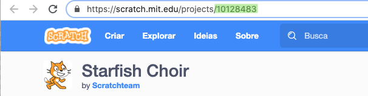

\--- challenge \---

## Desafio: Crie um novo Mostruário

Trinket não são a única coisa que você pode incorporar em uma página web. Você pode incorporar vídeos, widgets (como um widget do tempo) ou projetos do Scratch.

Abra o exemplo Scratch incorporado no trinket e execute-o: <https://trinket.io/html/9f7212b8fe>

Vá para o site do Scratch e encontre um projeto que você goste. Pode ser um dos seus ou um que você encontrou.

Se você está logado, você pode clicar no botão 'Embed' abaixo do projeto para obter o código HTML incorporado.

Se você não está logado, procure o número do projeto Scratch em seu endereço web.

Faça uma cópia do código `<iframe>` no exemplo Scratch incorporado e altere o número do projeto para o projeto que você deseja incorporar:

\--- /challenge \---