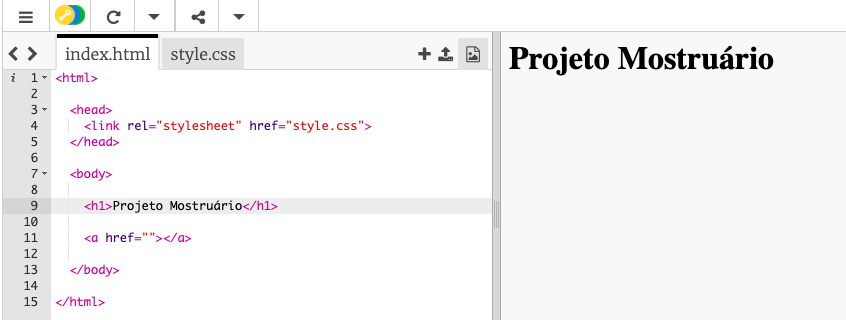
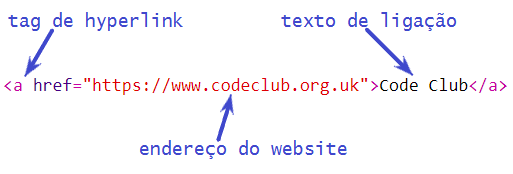
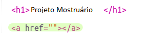
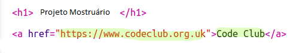
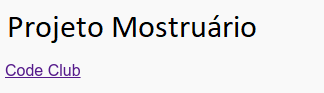
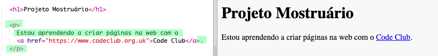

## Adicionando Links para Páginas da Web

Links de texto permitem que você clique em palavras para ir para outra página da web; eles são geralmente sublinhados.

+ Abra o trinket: [jumpto.cc/web-showcase](http://jumpto.cc/web-showcase).
    
    O projeto deve ficar assim:
    
    

+ O HTML usa a tag `<a>` para links.

+ Encontre a tag `<a>` no seu projeto. 

+ Adicione o endereço web do Code Club [`https://www.codeclub.org.uk`](https://www.codeclub.org.uk) e o texto do link:

+ Clique em Run para testar seu trinket.

+ Clique no link do Code Club para testar sua página web. Seu trinket agora mostrará a página do Code Club: 

+ Para voltar à sua página, você pode:
    
    + Executar seu trinket novamente,
    
    + Tocar na tecla Backspace no teclado ou
    
    + Clicar com o botão direito e selecionar Voltar.

+ Agora coloque o seu link em uma frase dentro de um parágrafo:

Teste sua página web.