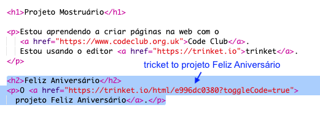

## Link para um trinket

Você pode vincular a página da web para um trinket.

+ Você manteve um link para o seu trinket "Feliz Aniversário"? Se você fez, abra esse trinket em outra aba ou janela do navegador. Caso contrário, abra o trinket de exemplo finalizado: <https://trinket.io/html/e996dc0380>

+ Clique no menu Share acima do seu trinket e escolha Link:

If you opened the trinket from your account then look for the Share option above your trinket instead:

+ Escolha 'Apenas mostrar código ou resultado (deixe os usuários alternarem entre eles)' e copie o link para o trinket. 

+ Volte para o seu trinket Projeto Mostruário e adicione um `<h2>` e um link para o seu Projeto Feliz Aniversário.

Teste sua página web; ela deve parecer com isto:

Clique no link "Feliz Aniversário" para ir e testar seu projeto no trinket.