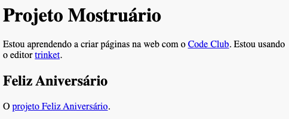

## Link para um Trinket

Você pode criar um link para um trinket.

+ Você manteve um link para o seu trinket "Feliz Aniversário"? Se você fez, abra esse trinket em outra aba ou janela do navegador. Caso contrário, abra o trinket de exemplo finalizado: <https://trinket.io/html/e996dc0380>

+ Clique no menu Share, acima do seu trinket, e escolha Link:

Se você abriu seu trinket a partir da sua conta, então procure a opção Share abaixo do seu trinket:

+ Escolha 'Apenas mostrar código ou resultado (deixe os usuários alternarem entre eles)' e copie o link para o trinket. 

+ Volte para o seu trinket Projeto Mostruário e adicione um `<h2>` e um link para o seu projeto Feliz Aniversário.

Teste sua página web; ela deve parecer com isto:

Clique no link "Feliz Aniversário" para ir e testar seu projeto no trinket.