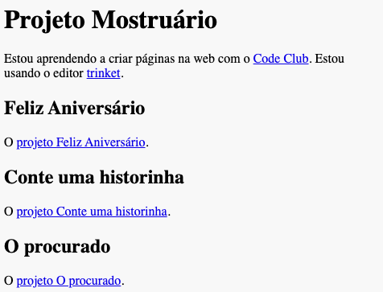

--- challenge ---

## Desafio: Crie uma lista dos seus Projetos

Adicione alguns dos outros projetos HTML & CSS que você criou no Code Club. Use a tag para título `<h2>` para organizar sua página web.

Se você não tiver links para os projetos que criou, poderá usar os exemplos do Code Club:

+ Feliz Aniversário: <https://trinket.io/html/e996dc0380>

+ Conte uma historinha: <https://trinket.io/html/c8afdef912>

+ O procurado: <https://trinket.io/html/ebeb56398a>

+ A receita: <https://trinket.io/html/c0fd9b40cd>

+ A carta misteriosa: <https://trinket.io/html/1d4d4c5ce1>

Sua página concluída deve ficar parecida com isto:

--- /challenge ---