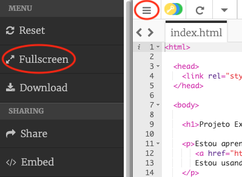

## Incorporando Projetos

Além de vincular a trinkets como páginas da Web, também podemos incorporá-los em uma página web.

+ Você pode tentar trabalhar no modo de tela cheia para ter mais espaço:

Pressione Esc para sair do modo de tela cheia.

+ Execute o seu trinket e clique no link Feliz Aniversário.

+ Clique no menu trinket e selecione **embed**. Se você não estiver no modo de tela cheia, talvez seja necessário rolar a tela. Use a barra de rolagem à direita ou a seta para baixo no teclado.

+ Escolha 'Apenas mostrar código ou resultado (deixe os usuários alternarem entre eles)' e **copie ** o código de incorporação para o trinket. 

+ Trinket criará um código HTML para você incluir em sua página da web. Ele usa uma tag `<iframe>` que permite que o conteúdo seja incorporado em uma página.

+ Agora cole esse código sob o link para o trinket Feliz Aniversário:

+ Execute seu trinket para testá-lo e você deve ver o seu projeto Feliz Aniversário incorporado na página web. 

+ Você pode achar que o fundo do seu trinket não está sendo exibido. Você pode corrigir isso alterando o valor da altura no `<iframe>`. 

Ajuste a altura para **400**. Se você fez alterações no projeto Feliz Aniversário, talvez seja necessário escolher um valor diferente.

