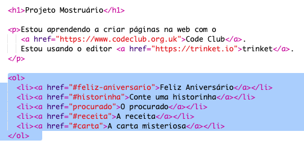

## Crie um índice

Vamos adicionar um índice para facilitar o acesso em cada projeto.

+ Além de poder vincular-se a outras páginas da Web, podemos vincular a partes de uma página da Web se fornecermos um Id. 

Adicione um Id ao cabeçalho `<h2>` do projeto Feliz Aniversário:

+ Adicione ids a cada um dos seus projetos e dê a eles nomes curtos: historinha, procurado, receita e carta.

+ Você pode vincular a um elemento com um id colocando um símbolo de hash ‘#’ na frente de seu nome. Por exemplo, `#feliz-aniversario`.

Crie uma lista ordenada de links para seus projetos. (Listas ordenadas são introduzidas no projeto Receita.)

+ Execute seu projeto e teste-o clicando nos links para acessar seus projetos. 

