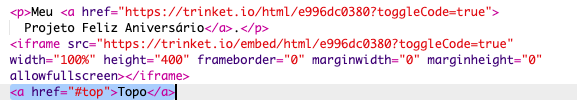
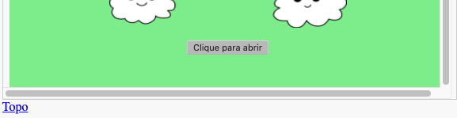

## Voltando ao topo

+ Também é útil poder navegar de volta ao topo da página. HTML tem o id `#top` para este propósito.

+ Adicione um link para `#top` após cada projeto incorporado na sua página web:

+ Teste seus links clicando em "Top" para voltar ao topo da página.