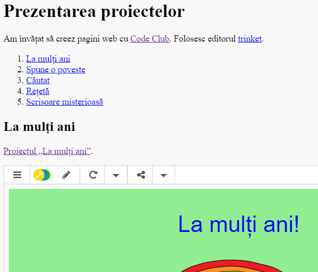

## Introducere

În acest proiect, vei crea o prezentare a proiectelor tale HTML și vei învăța despre link-uri și încorporarea resurselor.

### Informații suplimentare pentru liderii de club

Dacă dorești să imprimi acest proiect, te rugăm să folosești [Versiunea pentru imprimare](https://projects.raspberrypi.org/en/projects/project-showcase/print).

## \--- collapse \---

## title: Note pentru conducătorul de club

## Introducere:

În acest proiect, copiii vor învăța despre hyperlink-uri și încorporarea trinket-urilor și a proiectelor Scratch într-o pagină web.

## Resurse online

Îți recomandăm să folosești [trinket](https://trinket.io/) pentru a scrie HTML și CSS online. Acest proiect conține următorul trinket:

* [Punct de plecare "Proiectele mele" -- jumpto.cc/web-showcase](http://jumpto.cc/web-showcase)

Copiii pot, de asemenea, să folosească acest trinket gol [(jumpto.cc/html-blank)](http://jumpto.cc/html-blank) pentru a scrie propriul cod HTML & CSS sau, alternativ, acest șablon trinket [(jumpto.cc/html-template)](http://jumpto.cc/html-template).

Există, de asemenea, un trinket care conține un exemplu de soluție pentru provocări:

* ["Proiectele mele terminat" -- trinket.io/html/5b815ab120](https://trinket.io/html/5b815ab120)

## Resurse offline

Acest proiect poate fi [completat offline](https://www.codeclubprojects.org/en-GB/resources/webdev-working-offline/) dacă dorești. Poți accesa resursele proiectului dând click pe link-ul „Materiale pentru proiect”. Acest link conține o secțiune „Resursele proiectului”, care include resurse de care copiii vor avea nevoie pentru a completa acest proiect offline. Asigură-te că fiecare copil are acces la câte o copie din aceste resurse. Secțiunea include următoarele fișiere:

* project-showcase/index.html
* project-showcase/style.css
* template/template.html
* template/style.css

De asemenea, poți găsi o versiune completă a provocărilor din acest proiect în secțiunea „Resursele voluntarilor”, care conține:

* project-showcase-finished/index.html
* project-showcase-finished/style.css

(Toate resursele de mai sus se pot descărca ca și fișiere `.zip` pentru proiecte și voluntari.)

Este bine de știut că în cazul în care copiii și-au completat celelalte proiecte offline, ei nu le vor putea încorpora însă vor putea crea link-uri către ele.

## Obiective de învățare

* Acest proiect prezintă noțiuni legate de link-uri text către alte pagini web și id-uri denumite dintr-o pagină. De asemenea, prezintă și noțiuni legate de încorporarea trinket-urilor și proiectelor Scratch într-o pagină web. 

Acest proiect acoperă elemente din următoarele domenii ale [Raspberry Pi Digital Making Curriculum](http://rpf.io/curriculum):

* [Proiectarea elementelor grafice 2D și 3D de bază](https://www.raspberrypi.org/curriculum/design/creator).

## Provocări

* „Adaugă încă un link” - Adaugă link-uri către mai multe pagini web;
* „Creează o listă a proiectelor tale” - Creează link-uri către proiectele tale web anterioare;
* „Încorporează mai multe proiecte” - Folosește CSS pentru a crea stiluri noi.

\--- /collapse \---

## \--- collapse \---

## title: Materiale pentru proiect

## Resursele proiectului

* [fișier .zip care conține toate resursele proiectului](resources/showcase-project-resources.zip)
* [Trinket online care conține toate resursele proiectului „Proiectele mele”](http://jumpto.cc/web-showcase)
* [Șablon Trinket online](http://jumpto.cc/trinket-template)
* [Trinket online gol](http://jumpto.cc/trinket-blank)
* [template/index.html](resources/template-index.html)
* [template/style.css](resources/template-style.css)
* [project-showcase/index.html](resources/project-showcase-index.html)
* [project-showcase/style.css](resources/project-showcase-style.css)

## Resursele liderului de club

* [fișier .zip care conține toate resursele proiectului, completate](resources/showcase-volunteer-resources.zip)
* [Proiect Trinket online, completat](https://trinket.io/html/1d4d4c5ce1)
* [project-showcase-finished/index.html](resources/project-showcase-finished-index.html)
* [project-showcase-finished/style.css](resources/project-showcase-finished-style.css)

\--- /collapse \---