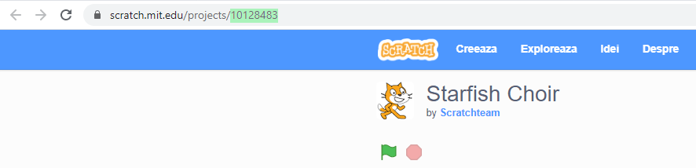

\--- challenge \---

## Provocare: Creează o prezentare nouă

Trinket-urile nu sunt singurele lucruri pe care le poți încorpora într-o pagină web. Poți încorpora videoclipuri, widget-uri (cum ar fi widget-uri despre vreme) sau proiecte Scratch.

Deschide trinket-ul exemplu pentru încorporarea proiectelor Scratch și rulează-l: [https://trinket.io/html/9f7212b8fe/](https://trinket.io/html/9f7212b8fe)

Mergi pe site-ul Scratch și găsește un proiect care îți place. Poate fi al tău sau unul pe care l-ai găsit.

Dacă ești autentificat, poți apăsa pe butonul „Embed” de sub proiect pentru a obține codul de încorporare HTML.

Dacă nu ești autentificat, caută numărul proiectului Scratch în adresa sa web.

Creează o copie a codului `<iframe>` din exemplul încorporării proiectelor Scratch și schimbă numărul proiectului cu cel al proiectului pe care vrei să îl încorporezi:

\--- /challenge \---