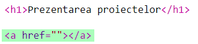
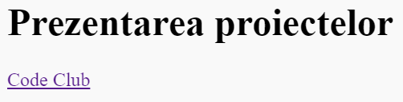

## Adăugarea link-urilor către pagini web

Link-urile îți permit să dai click pe cuvinte pentru a merge pe altă pagină web; de cele mai multe ori sunt subliniate.

+ Deschide acest trinket: [jumpto.cc/web-showcase](http://jumpto.cc/web-showcase).
    
    Proiectul ar trebui să arate așa:
    
    

+ HTML folosește tag-ul `<a>` pentru link-uri.

+ Găsește tag-ul `<a>` în proiectul tău. 

+ Adaugă adresa site-ului web Code Club [`https://www.codeclub.org.uk`](https://www.codeclub.org.uk) și textul link-ului:

+ Apasă pe Run pentru a testa trinket-ul.

+ Apasă pe link-ul Code Club pentru a testa pagina ta web. Trinket-ul tău va arăta acum pagina web Code Club: 

+ Pentru a te întoarce la pagina ta, poți să:
    
    + Rulezi trinket-ul din nou,
    
    + Apeși tasta Backspace pe tastatură sau să
    
    + Dai click-dreapta și să selectezi Înapoi.

+ Now put your link into a sentence inside a paragraph:

Test your webpage.