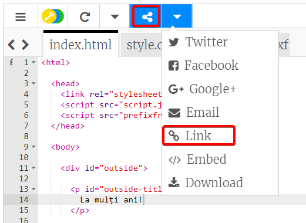
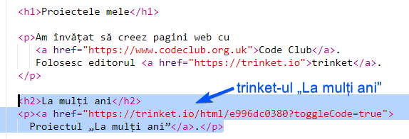
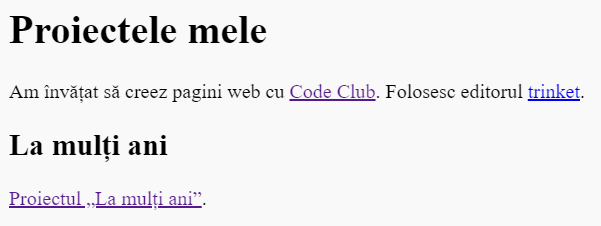

## Creează un link către un Trinket

Poți crea un link către pagina web a unui trinket.

+ Ai păstrat un link de la trinket-ul tău de „La mulți ani”? Dacă da, deschide acel trinket în altă fereastră. Dacă nu, deschide acest exemplu finalizat: <https://trinket.io/html/e996dc0380>

+ Apasă pe meniul Share de deasupra trinket-ului și alege Link:

Dacă ai deschis trinket-ul de pe contul tău, atunci uită-te după opțiunea Share deasupra trinket-ului tău:

+ Alege „Only show code or result (let users toggle between them)” și copiază link-ul către trinket. 

+ Întoarce-te la trinket-ul tău „Proiectele mele” și adaugă un heading `<h2>` și un link către proiectul tău de „La mulți ani”.

Testează pagina ta web; ar trebui să arate asemănător:

Apasă pe link-ul de „La mulți ani” pentru a testa dacă te duce către trinket.