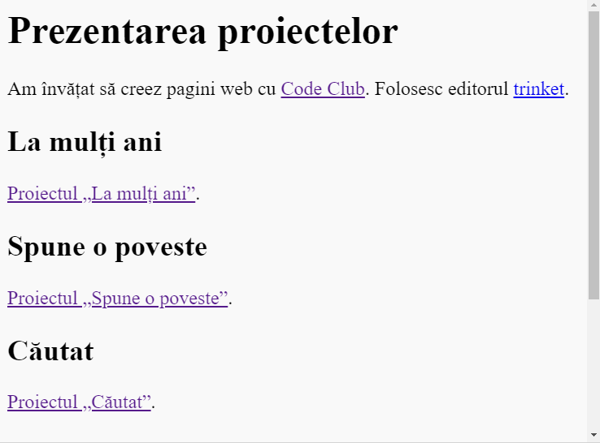

\--- challenge \---

## Provocare: Creează o listă a proiectelor tale

Adaugă câteva dintre celelalte proiecte HTML și CSS pe care le-ai creat la Code Club. Use `<h2>` headings to organise your webpage.

If you don't have links to the projects you created then you can use the Code Club examples:

+ Happy Birthday: <https://trinket.io/html/e996dc0380>

+ Tell a Story: <https://trinket.io/html/c8afdef912>

+ Wanted: <https://trinket.io/html/ebeb56398a>

+ Recipe: <https://trinket.io/html/c0fd9b40cd>

+ Mystery Letter: <https://trinket.io/html/1d4d4c5ce1>

Your finished page should look something like this:

\--- /challenge \---