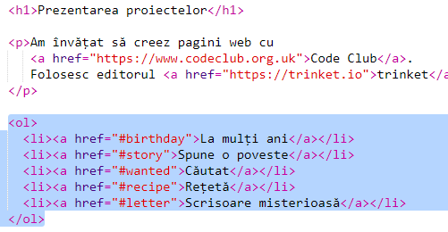
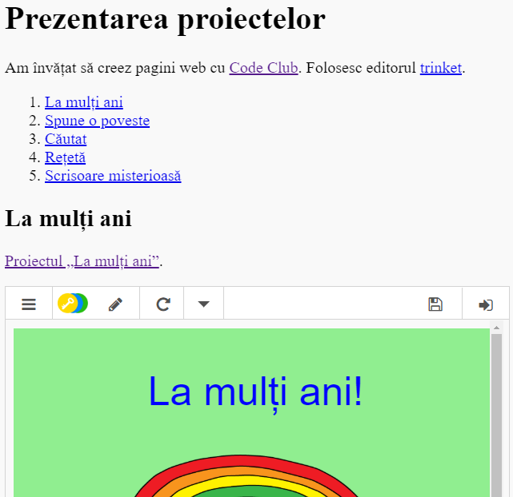

## Creează un cuprins

Hai să adăugăm un cuprins pentru a putea ajunge cu ușurință la fiecare proiect.

+ Putem crea, pe lângă link-uri către alte pagini web, link-uri către părți ale unei pagini web dacă le dăm un id. 

Adaugă un id heading-ului `<h2>` al proiectului „La mulți ani”:

+ Adaugă id-uri fiecărui proiect și dă-le denumiri scurte: poveste, cautat, reteta și scrisoare.

+ Poți crea un link către un element cu un id folosind simbolul „#” în fața numelui său. For example, `#birthday`.

Create an ordered list of links to your projects. (Ordered lists are introduced in the Recipe project.)

+ Run your project and test it by clicking on the links to move to your projects. 

