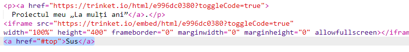
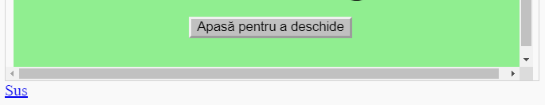

## Revenirea la început

+ Este, de asemenea, util să poți naviga înapoi la începutul paginii. HTML are `#top` cu acest scop.

+ Adaugă un link către `#top` după fiecare proiect încorporat în pagina ta web:

+ Testează link-urile apăsând pe Început pentru a reveni la începutul paginii.