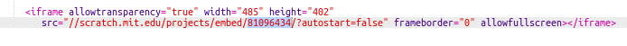

\--- meydan okuma \---

## Challenge: Create a New Showcase

Trinkets aren't the only thing you can embed in a webpage. You can embed videos, widgets (such as a weather widget) or Scratch projects.

Open the Embed Scratch Example trinket and Run it: <https://trinket.io/html/9f7212b8fe>

Scratch web sitesine gidin ve sevdiğiniz bir proje bulun. It can be one of your own or one you've found.

If you are logged in you can click the 'Embed' button below the project to get the HTML embed code.

Giriş yapmadıysanız, Scratch proje numarasını web adresinde arayın.

Make a copy of the `<iframe>` code in the Scratch Embed example and change the project number to the one for the project you want to embed:

\--- /meydan okuma \---