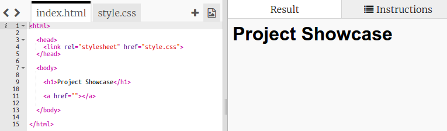

## Web Sayfalarına Bağlantı Ekleme

Text links allow you to click on words to go to another web page; they are usually underlined.

+ Open this trinket: [jumpto.cc/web-showcase](http://jumpto.cc/web-showcase).
    
    Proje şöyle görünmeli:
    
    

+ HTML, bağlantılar için `<a>` etiketini kullanır.

+ Projenizdeki `<a>` etiketini bulun. 

+ Add the Code Club website address [`https://www.codeclub.org.uk`](https://www.codeclub.org.uk) and link text:

+ Click Run to test your trinket.

+ Web sayfanızı test etmek için Code Club linkini tıklayın. Your trinket will now show the Code Club webpage: 

+ Sayfanıza geri dönmek için aşağıdakilerden birini yapabilirsiniz:
    
    + Run your trinket again,
    
    + Klavyede Geri tuşuna dokunun veya
    
    + Sağ tıklayın ve Geri'yi seçin.

+ Şimdi bağlantınızı paragrafın içindeki bir cümleye yerleştirin:

Web sayfanızı test edin.