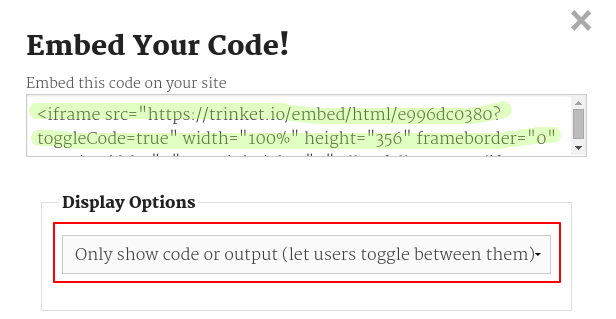

## Gömme Projeler

Web sayfalarındaki biblolara bağlantı sağlamanın yanı sıra, onları bir web sayfasına gömebiliriz.

+ Tam ekran modunda çalışmayı denemek isteyebilirsiniz, böylece daha fazla alanınız olur:

Tam ekran modundan çıkmak için Esc tuşuna basın.

+ Trinketinizi çalıştırın ve Doğum günün kutlu olsun bağlantısını tıklayın.

+ Trinket menüsüne tıklayın ve **embed**i seçin. Tam Ekran modunda değilseniz kaydırma yapmanız gerekebilir. Sağdaki kaydırma çubuğunu veya klavyedeki aşağı oku kullanın.

+ 'Yalnızca kodu veya sonucu göster (kullanıcıların aralarında geçiş yapmasına izin ver)' seçeneğini belirleyin ve **trinket için embed kodunu** kopyalayın. 

+ Trinket, web sayfanıza eklemeniz için bazı HTML'ler oluşturdu. İçeriğin bir sayfaya gömülmesine izin veren `<iframe>` etiketi kullanır.

+ Şimdi bu kodu Mutlu yıllar biblo bağlantısına ekleyin

+ Test etmek için trinketinizi çalıştırın ve Happy Birthday projenizi web sayfasına yerleştirilmiş olarak görmelisiniz. 

+ Trinketinizin en alt kısmının görünmediğini görebilirsiniz. Bunu `<iframe>`yükseklik değerini değiştirerek düzeltebilirsiniz. 

Yüksekliği **400**'e ayarlayın. Doğum Günün Kutlu Olsun projesinde değişiklik yaptıysanız, farklı bir değer seçmeniz gerekebilir.

