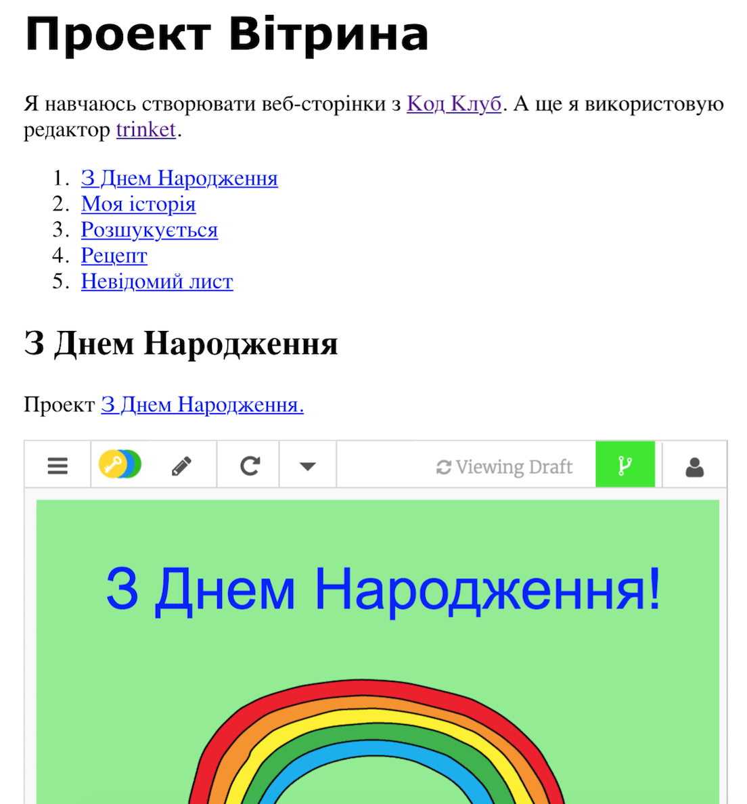

## Вступ

У цьому проекті ви створите вітрину своїх HTML проектів і дізнаєтеся про посилання та вкладення ресурсів.

### Додаткова інформація для лідерів клубу

Якщо вам потрібно роздрукувати цей проект, скористайтеся [ Версія для друку ](https://projects.raspberrypi.org/en/projects/project-showcase/print).

## \--- collapse \---

## керівник клубу відзначає

## Введення:

У цьому проекті діти познайомилися з гіперпосиланнями та вбудованим Trinket та проектами Scratch на веб-сторінці.

## Інтернет-ресурси

Ми рекомендуємо використовувати [ trinket ](https://trinket.io/), щоб написати HTML & CSS онлайн. Цей проект містить такий trinket:

* [Відправна точка "Вітрина проекту"-- jumpto.cc/web-showcase](http://jumpto.cc/web-showcase)

Діти також можуть скористатися цим порожнім trinket [ (jumpto.cc / html-blank) ](http://jumpto.cc/html-blank), щоб написати свій власний HTML & CSS, або ж вони можуть використовувати цей шаблон trinket[ (jumpto.cc/html-template) ](http://jumpto.cc/html-template).

Існує також trinket, що містить вибіркове рішення для вирішення проблем:

* ["Вітрина проекту завершена" - trinket.io/html/5b815ab120](https://trinket.io/html/5b815ab120)

## Оффлайн ресурси

Цей проект може бути [ завершено оффлайн ](https://www.codeclubprojects.org/en-GB/resources/webdev-working-offline/), якщо це є бажаним. Ви можете отримати доступ до ресурсів проекту, натиснувши посилання "Матеріали проекту" для цього проекту. Це посилання містить розділ "Ресурси проекту", який включає в себе ресурси, необхідні для завершення цього проекту в режимі оффлайн. Переконайтеся, що кожна дитина має доступ до копії цих ресурсів. Цей розділ містить наступні файли:

* project-showcase/index.html
* project-showcase/style.css
* template/template.html
* template/style.css

Ви також можете знайти завершену версію викликів цього проекту у розділі "Ресурси волонтерів", яка містить:

* project-showcse-finished/index.html
* project-showcse-finished/style.css

(Усі вищезазначені ресурси також можна завантажувати як проектні та добровільні файли `.zip `.)

Зауважте, що якщо діти завершили свої інші проекти в автономному режимі, вони не зможуть вставляти їх, але вони все одно зможуть зв'язати їх.

## Мета навчання

* Цей проект представляє текстові посилання на інші веб-сторінки та назви ідентифікаторів на сторінці. Він також вводить вбудовані trinket та проекти Scratch на веб-сторінку. 

Цей проект охоплює елементи з наступних напрямків навчального плану [Raspberry Pi Digital Making Curriculum](http://rpf.io/curriculum):

* [ Розробіть основні 2D та 3D атрибути ](https://www.raspberrypi.org/curriculum/design/creator).

## Виклики

* "Додати іншу посилання" - Додати посилання на інші веб-сторінки;
* "Створення списку ваших проектів" - створення посилань на попередні веб-проекти;
* "Вкласти інші проекти" - використовуйте CSS для створення нових стилів.

\--- /collapse \---

## \--- collapse \---

## матеріали проекту

## Ресурси проекту

* [.zip-файл, що містить всі ресурси проекту](resources/showcase-project-resources.zip)
* [Онлайн Trinket - з усіма ресурсами проекту "Вітрина проекту"](http://jumpto.cc/web-showcase)
* [Шаблон онлайн- Trinket](http://jumpto.cc/trinket-template)
* [Онлайн чистийTrinket](http://jumpto.cc/trinket-blank)
* [template/index.html](resources/template-index.html)
* [template/style.css](resources/template-style.css)
* [project-showcase/index.html](resources/project-showcase-index.html)
* [project-showcase/style.css](resources/project-showcase-style.css)

## Ресурси лідерів клубу

* [.zip-файл, що містить всі завершені ресурси проекту](resources/showcase-volunteer-resources.zip)
* [Онлайн завершив проект Trinket](https://trinket.io/html/1d4d4c5ce1)
* [project-showcase-finished/index.html](resources/project-showcase-finished-index.html)
* [project-showcase-finished/style.css](resources/project-showcase-finished-style.css)

\--- /collapse \---