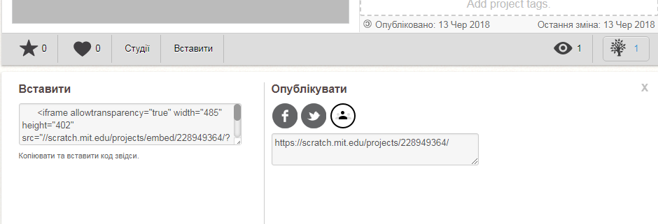
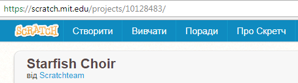

--- challenge ---

## Виклик: поліпшити свою вітрину

Trinket- це не єдине, що можна вставити на веб-сторінку. Ви можете вставляти відео, віджети (наприклад, weather widget) або проекти Scratch.

Відкрийте примірник Embed Scratch Example і запустіть його: [https://trinket.io/html/9f7212b8fe](https://trinket.io/html/9f7212b8fe)

Перейдіть на веб-сайт Scratch та знайдіть потрібний вам проект. Це може бути один з ваших проектів або проект який ви знайшли.

Якщо ви ввійшли в систему, ви можете натиснути кнопку "Вставити" під проектом, щоб отримати код вставки HTML.

Якщо ви не ввійшли в систему, то знайдіть його номер веб-адреси на номер Scratch.

Зробіть копію коду `<iframe>` у прикладі Scratch Embed та змініть номер проекту на той, який потрібно вставити для проекту:

--- /challenge ---

Переклад спільноти волонтерів 

Цей проект переклали: Тетяна Сковронська і перевірили: Валентина Мостова. 

Наші чудові добровольці з питань перекладу допомагають нам надати дітям у всьому світі можливість навчитися програмувати. Ви можете допомогти нам охопити більше дітей, перекладаючи наші проекти - подробиці на [rpf.io/translators](https://rpf.io/translators).
