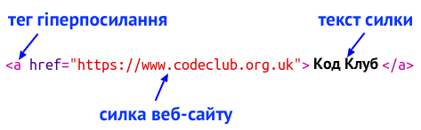
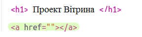
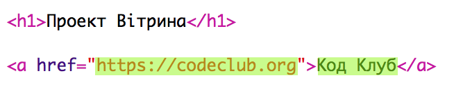
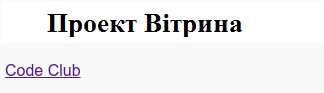
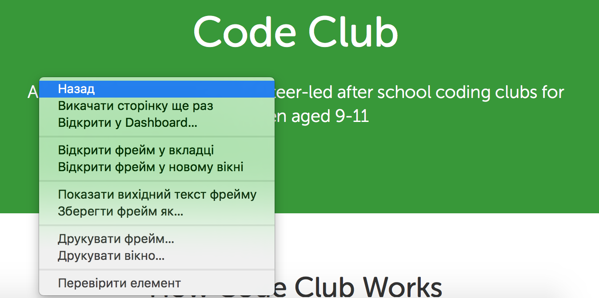
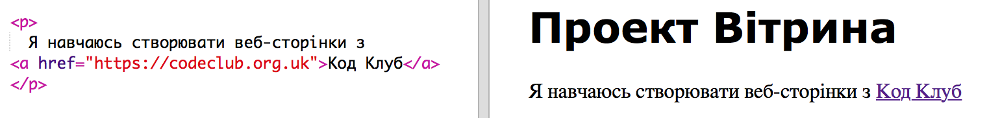

## Додавання посилань на веб-сторінки

Текстові посилання дозволяють натискати на слова, щоб перейти на іншу веб-сторінку; вони, як правило, підкреслюються.

+ Відкрийте Trinket: [trinket.io/html/11485d0234](http://trinket.io/html/11485d0234).
    
    Проект повинен виглядати так:
    
    

+ HTML використовує тег `<a>` для посилань.

+ Знайдіть тег `<a>` у вашому проекті. 

+ Додайте адресу веб-сайту Code Club [`https://www.codeclub.org.uk`](https://www.codeclub.org.uk) та текст посилання:

+ Натисніть «Виконати», щоб протестувати свій Trinket.

+ Клацніть по посиланню Code Club, щоб протестувати вашу веб-сторінку. Тепер ваш Trinket відображатиме веб-сторінку Code Club: 

+ Щоб повернутися на свою сторінку, ви можете:
    
    + Запустіть свій Trinket знову
    
    + Натисніть клавішу Backspace на клавіатурі або
    
    + Клацніть правою кнопкою миші та виберіть "Назад".

+ Тепер покладіть посилання на речення всередині абзацу:

Перевірте свою веб-сторінку.