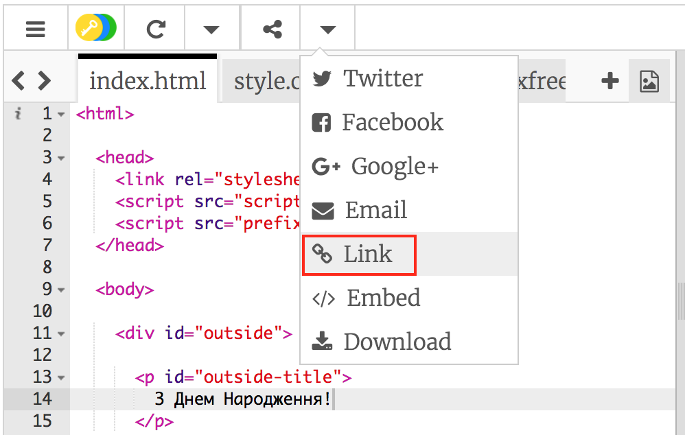
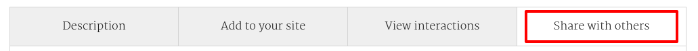
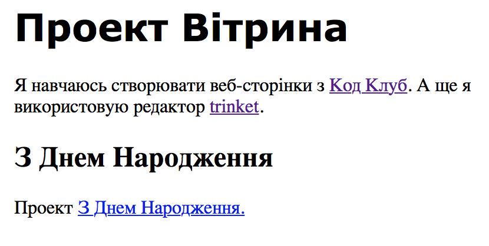

## Посилання на Trinket

Ви можете послати на веб-сторінку Trinket.

+ Ти зберіг посилання на твій Trinket З Днем Народження? Якщо ви зробили, відкрийте цей Trinket в іншій вкладці або вікні веб-переглядача. Інакше відкрийте готовий приклад Trinket: [ https://trinket.io/html/e996dc0380 ](https://trinket.io/html/e996dc0380)

+ Натисніть меню "Спільнота" над своїм Trinket та виберіть "Посилання:":

Якщо ви відкрили Trinket з вашого облікового запису, шукайте опцію "Надати доступ" над своїм Trinket інструментом:

+ Виберіть "Показати лише код або результат (дозвольте користувачам переключатися між ними)" та скопіюйте посилання на Trinket. 

+ Поверніться до вашої демонстраційної дрібниці проекту та додайте заголовок `<h2>` та посилання на ваш проект З Днем Народження.

Перевірте свою веб-сторінку; це має виглядати приблизно так:

Натисніть посилання "З Днем народження", щоб перевірити, що він приведе вас до Trinket.