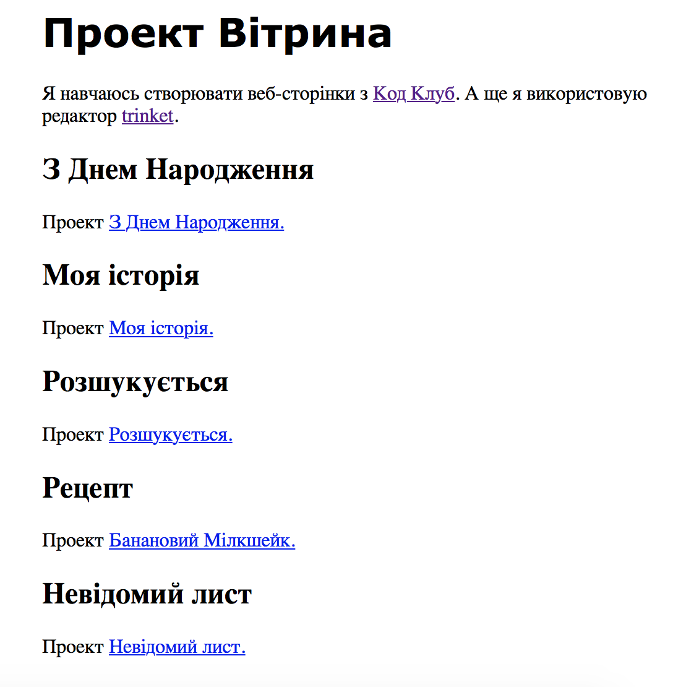

--- challenge ---

## Виклик: створити список ваших проектів

Додайте деякі інші HTML & CSS-проекти, які ви створили в Code Club. Використовуйте заголовки `<h2>` для упорядкування своєї веб-сторінки.

Якщо у вас немає посилань на створені вами проекти, ви можете використовувати приклади Code Club:

+ Інакше відкрийте готовий приклад Trinket: [https://trinket.io/html/e996dc0380](https://trinket.io/html/e996dc0380)

+ Моя історія: [https://trinket.io/html/c8afdef912](https://trinket.io/html/c8afdef912)

+ Розшукується: [https://trinket.io/html/ebeb56398a](https://trinket.io/html/ebeb56398a)

+ Рецепт: [https://trinket.io/html/c0fd9b40cd](https://trinket.io/html/c0fd9b40cd)

+ Невідомий Лист: <https://trinket.io/html/1d4d4c5ce1>

Ваша готова сторінка повинна виглядати приблизно так:

--- /challenge ---