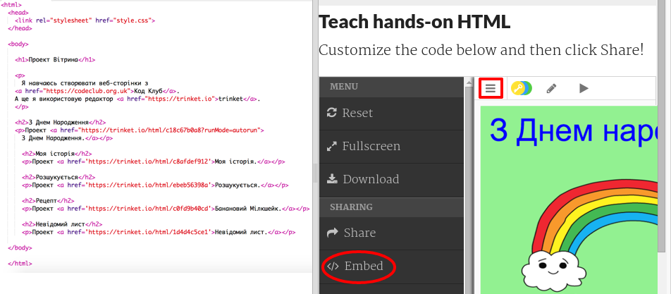
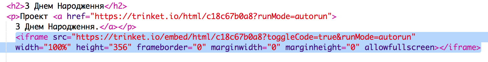

## Вбудовування проектів

Крім того, посилання на Trinket як веб-сторінки, ми також можемо вставити їх на веб-сторінку.

+ Ви можете спробувати працювати в режимі Fullscreen, щоб мати більше місця:

Натисніть клавішу Esc, щоб вийти з повноекранного режиму.

+ Запустіть свій Trinket та натисніть посилання З Днем Народження.

+ Натисніть на меню Trinket та виберіть ** вставити **. Якщо ви не перебуваєте у повноекранному режимі, можливо, вам доведеться прокручувати. Використовуйте смугу прокрутки правою або стрілкою вниз на клавіатурі.

+ Виберіть "Показати лише код або результат (дозвольте користувачам переключатися між ними)" та ** скопіювати ** код вставки для Trinket. 

+ Trinket створив який-небудь HTML для включення вашої веб-сторінки. Він використовує тег `<iframe>`, який дозволяє вбудовувати вміст на сторінку.

+ Тепер вставте цей код під посиланням на Trinket З Днем Народження:

+ Запустіть свій Trinket, щоб перевірити його, і ви повинні побачити свій проект З Днем Народження, вбудований на веб-сторінку. 

+ Ви можете виявити, що нижня частина Trinket не відображається. Ви можете виправити це, змінюючи значення висоти на `<iframe>`. 

Встановіть висоту до ** 400 **. Якщо ви внесли зміни до проекту З Днем Народження, вам може знадобитися вибрати інше значення.

