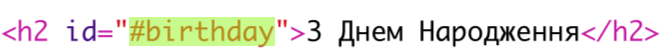
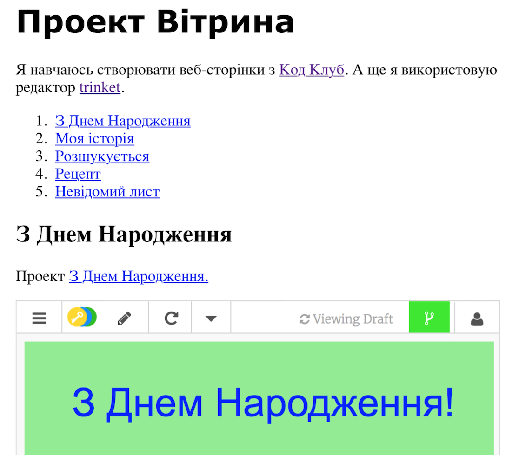

## Створіть зміст

Додамо зміст, щоб ми могли легко перейти до кожного проекту.

+ Окрім можливості посилання на інші веб-сторінки, ми можемо посилатися на частини веб-сторінки, якщо ми надаємо їм ідентифікатор. 

Додайте ідентифікатор заголовка `<h2>` для проекту З Днем Народження:

+ Додайте ідентифікатори до кожного з ваших проектів та надішліть їм короткі імена: історія, розшукується, рецепт та лист.

+ Ви можете посилатись на елемент з ідентифікатором, ввівши символ хешу "#" перед його ім'ям. Наприклад, `#деньнародження`.

Створіть упорядкований список посилань на ваші проекти. (Замовлені списки вводяться в рецепт проекту.)

+ Запустіть свій проект і перевірте його, натиснувши посилання, щоб перейти до ваших проектів. 

