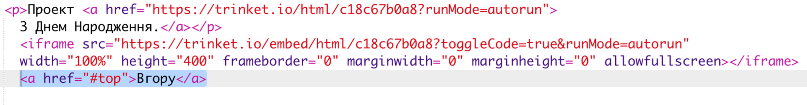

## Повернутися до Топу

+ Також корисно мати можливість переходити до верхньої частини сторінки. HTML має `#top` для цієї мети.

+ Додайте посилання на `#top` після кожного вбудованого проекту на свою веб-сторінку:

+ Перевірте свої посилання, натиснувши кнопку "Вгору", щоб повернутися до верхньої частини сторінки.