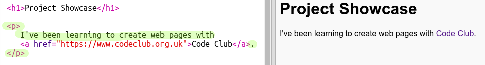

## 在网页中添加链接

Text links allow you to click on words to go to another web page; they are usually underlined.

+ 打开这个Trinket: [jumpto.cc/web-showcase](http://jumpto.cc/web-showcase)。
    
    效果应该是这样：
    
    

+ HTML 使用 `<a>` 标签来表示链接

+ 在你的项目查找 `<a>` 标签 

+ 添加 Code Club 网址链接 [`https://www.codeclub.org.uk`](https://www.codeclub.org.uk) 和文字链接

+ 点击 Run 来测试你的 trinket

+ Click on the Code Club link to test your webpage. Your trinket will now show the Code Club webpage: 

+ To get back to your page you can either:
    
    + Run your trinket again,
    
    + Tap the Backspace key on the keyboard, or
    
    + Right-click and choose Back.

+ Now put your link into a sentence inside a paragraph:

Test your webpage.