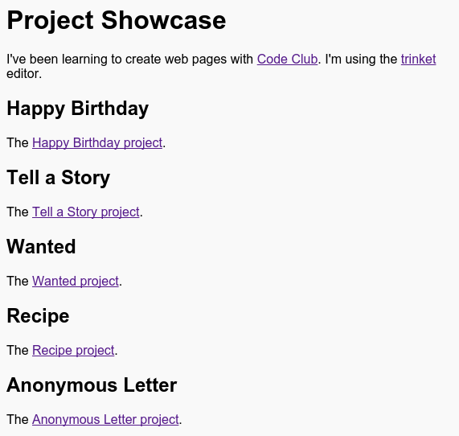

\--- 挑战 \---

## 挑战：创建你的项目列表

添加一些你在 Code Club 创建的 HTML & 和 CSS 项目， 你可以使用`<h2>`标签来组织你的网页。

如果你没有你所创建的项目链接，你可以使用 Code Club 的示例：

+ 生日快乐： <https://trinket.io/html/e996dc0380>

+ 讲故事： <https://trinket.io/html/c8afdef912>

+ 寻物启事：<https://trinket.io/html/ebeb56398a>

+ 食谱： <https://trinket.io/html/c0fd9b40cd>

+ 神秘信件： <https://trinket.io/html/1d4d4c5ce1>

你完成的页面看起来应该是这样：

-/挑战\---