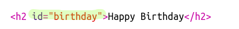

## Create a Table of Contents

Let's add a Table of Contents so we can easily get to each project.

+ As well as being able to link to other webpages, we can link to parts of a webpage if we give them an id. 

Add an id to the `<h2>` heading for the Happy Birthday project:

+ Add ids to each of your projects and give them short names: story, wanted, recipe and letter.

+ You can link to an element with an id by putting a hash ‘#’ symbol in front of its name. For example, `#birthday`.

Create an ordered list of links to your projects. (Ordered lists are introduced in the Recipe project.)

+ Run your project and test it by clicking on the links to move to your projects. 

